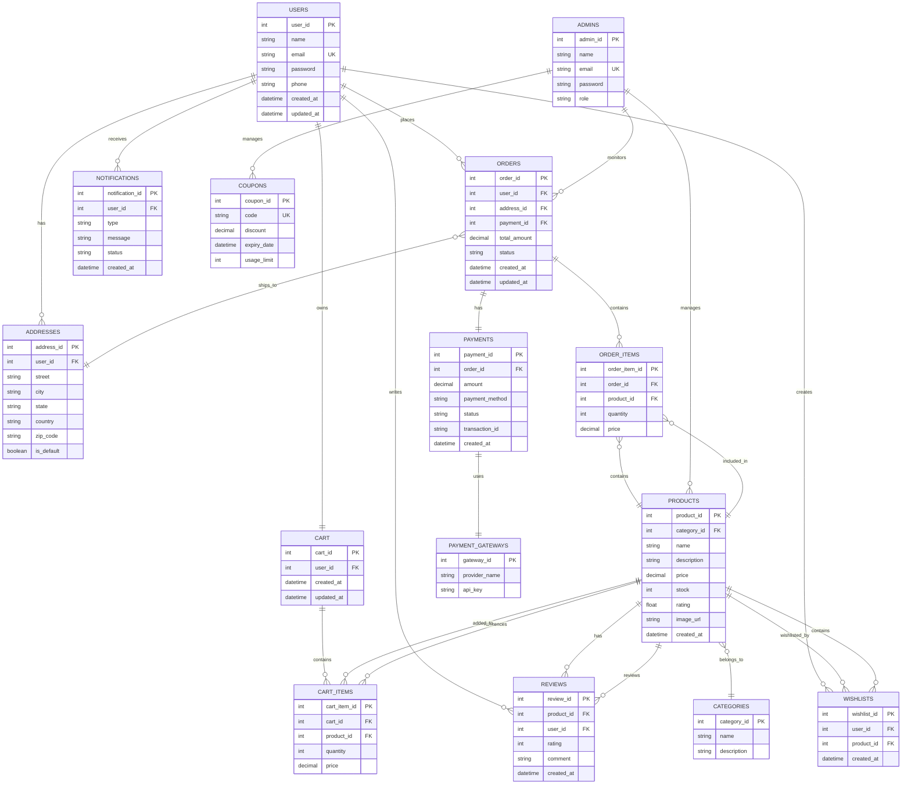

# E-Commerce Platform - Entity Relationship Diagram

## Entity Descriptions

### USERS
Stores customer information including authentication credentials and contact details.
- **Primary Key**: user_id
- **Unique Key**: email
- **Relationships**: Has multiple addresses, places orders, writes reviews, creates wishlists, receives notifications

### ADDRESSES
Stores multiple delivery addresses for each user.
- **Primary Key**: address_id
- **Foreign Key**: user_id
- **Special Attributes**: is_default (boolean to mark preferred address)

### CATEGORIES
Product categories for organizing the catalog.
- **Primary Key**: category_id
- **Relationships**: One category has many products

### PRODUCTS
Core product catalog with pricing and inventory.
- **Primary Key**: product_id
- **Foreign Key**: category_id
- **Relationships**: Can be in carts, orders, wishlists, and have reviews

### CART
Temporary shopping cart for each user.
- **Primary Key**: cart_id
- **Foreign Key**: user_id
- **Unique Constraint**: One cart per user

### CART_ITEMS
Individual items in a shopping cart.
- **Primary Key**: cart_item_id
- **Foreign Keys**: cart_id, product_id
- **Attributes**: quantity, price (for historical tracking)

### ORDERS
Completed purchase orders with status tracking.
- **Primary Key**: order_id
- **Foreign Keys**: user_id, address_id, payment_id
- **Attributes**: total_amount, status (pending, shipped, delivered, cancelled)

### ORDER_ITEMS
Individual products included in an order.
- **Primary Key**: order_item_id
- **Foreign Keys**: order_id, product_id
- **Attributes**: quantity, price (snapshot of price at purchase time)

### PAYMENTS
Payment transaction details and status.
- **Primary Key**: payment_id
- **Foreign Key**: order_id, gateway_id
- **Attributes**: amount, payment_method, status, transaction_id

### PAYMENT_GATEWAYS
External payment providers (Stripe, PayPal, etc.).
- **Primary Key**: gateway_id
- **Attributes**: provider_name, api_key

### REVIEWS
Customer product reviews and ratings.
- **Primary Key**: review_id
- **Foreign Keys**: product_id, user_id
- **Relationships**: Each product can have multiple reviews from different users

### WISHLISTS
Bookmarked products for future purchase.
- **Primary Key**: wishlist_id
- **Foreign Keys**: user_id, product_id

### COUPONS
Discount codes and promotional offers.
- **Primary Key**: coupon_id
- **Unique Key**: code
- **Attributes**: discount (percentage or fixed amount), expiry_date, usage_limit

### NOTIFICATIONS
System notifications for order updates and promotions.
- **Primary Key**: notification_id
- **Foreign Key**: user_id
- **Attributes**: type (order_update, promotion, etc.), status (read/unread)

### ADMINS
Administrative users with management capabilities.
- **Primary Key**: admin_id
- **Unique Key**: email
- **Attributes**: role (super_admin, product_manager, order_manager)

## Relationship Types

- **Solid Lines (Identifying)**: Strong dependencies where child entity cannot exist without parent
- **Dashed Lines (Non-identifying)**: Weak relationships where entities can exist independently

## Key Cardinalities

- **1:N (One-to-Many)**: User has many orders, product has many reviews
- **1:1 (One-to-One)**: User has one cart, order has one payment
- **N:M (Many-to-Many)**: Resolved through junction tables (CART_ITEMS, ORDER_ITEMS)
