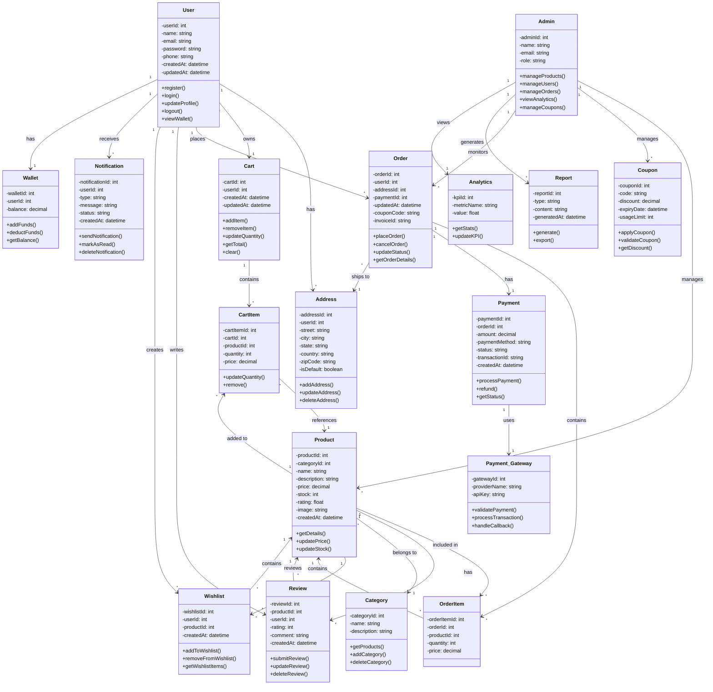

# E-Commerce Platform - Class Diagram

## Class Descriptions

### User
Represents a customer in the system with authentication and profile management capabilities.

### Address
Stores multiple delivery addresses for each user.

### Product
Core entity representing items available for purchase with pricing and inventory details.

### Category
Groups products into logical categories for easy browsing.

### Cart
Temporary shopping cart for each user containing selected items before checkout.

### CartItem
Individual items within a shopping cart with quantity and pricing.

### Order
Represents a completed purchase with order status tracking.

### OrderItem
Individual products included in an order.

### Payment
Handles payment processing and transaction tracking.

### Review
Customer reviews and ratings for products.

### Wishlist
Allows users to save products for future purchase.

### Coupon
Discount codes that can be applied to orders.

### Admin
Administrative user with privileges to manage products, users, and orders.

### Notification
System for sending order updates and promotional messages to users.

### Wallet
Digital wallet for users to store balance and make payments.

### Report
Structured data document generated for business analysis.

### Analytics
Real-time performance metrics and KPIs for the platform.

### Payment_Gateway
Integration with external payment providers for secure transaction processing.
