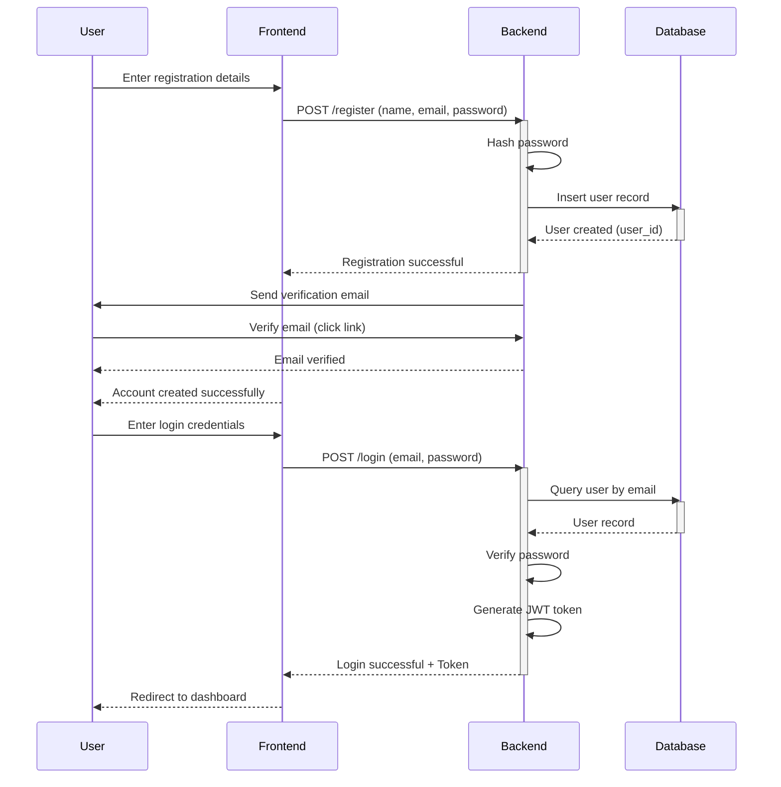
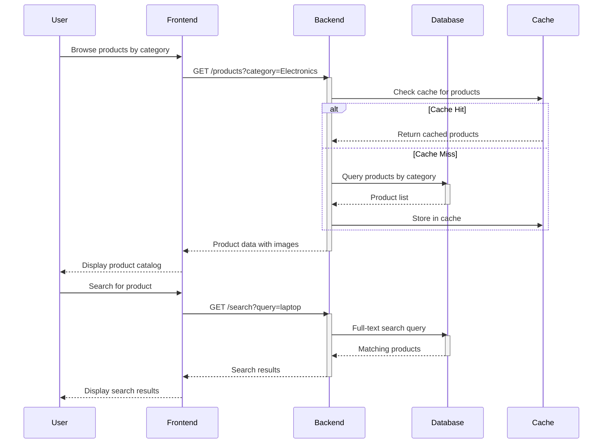
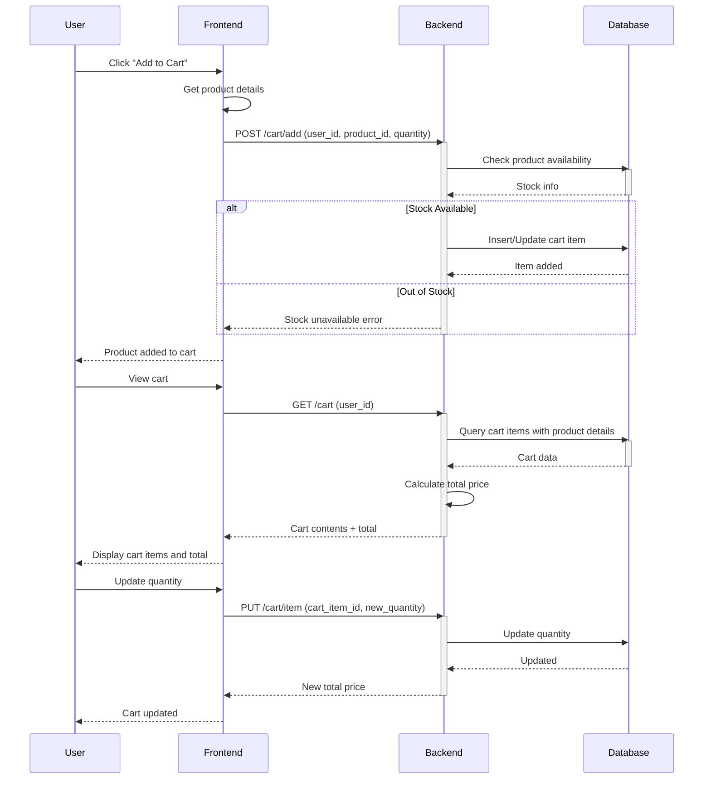
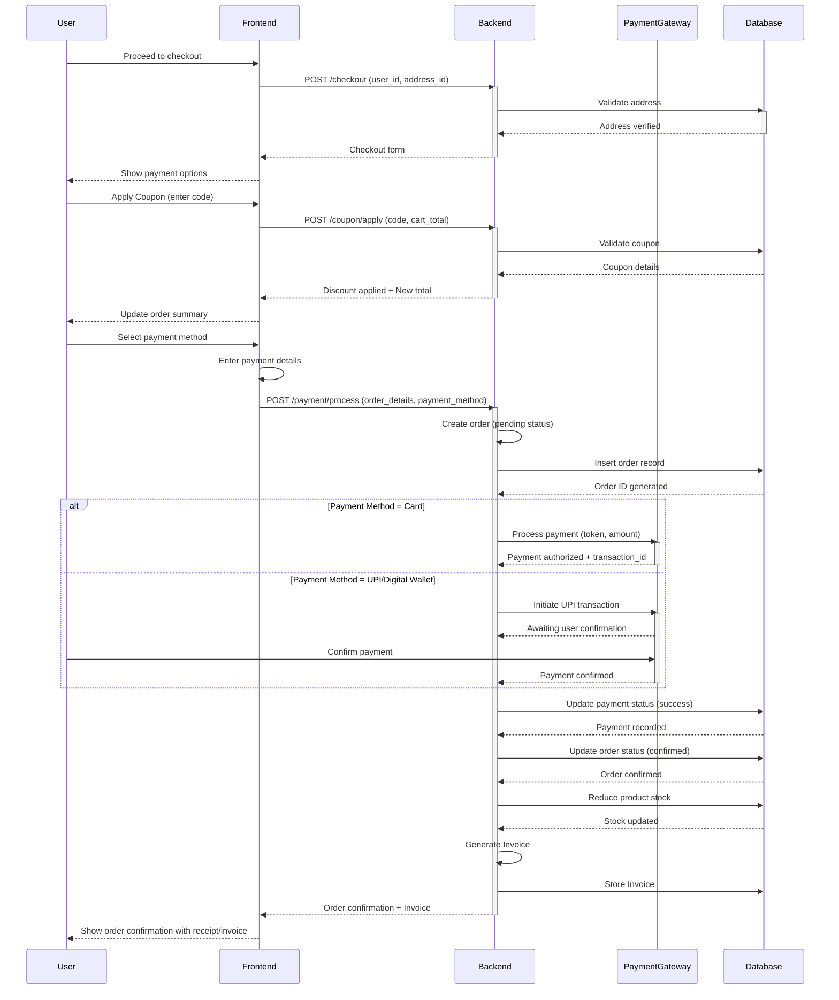
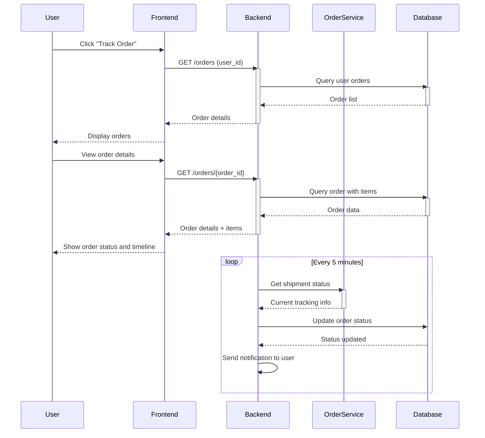
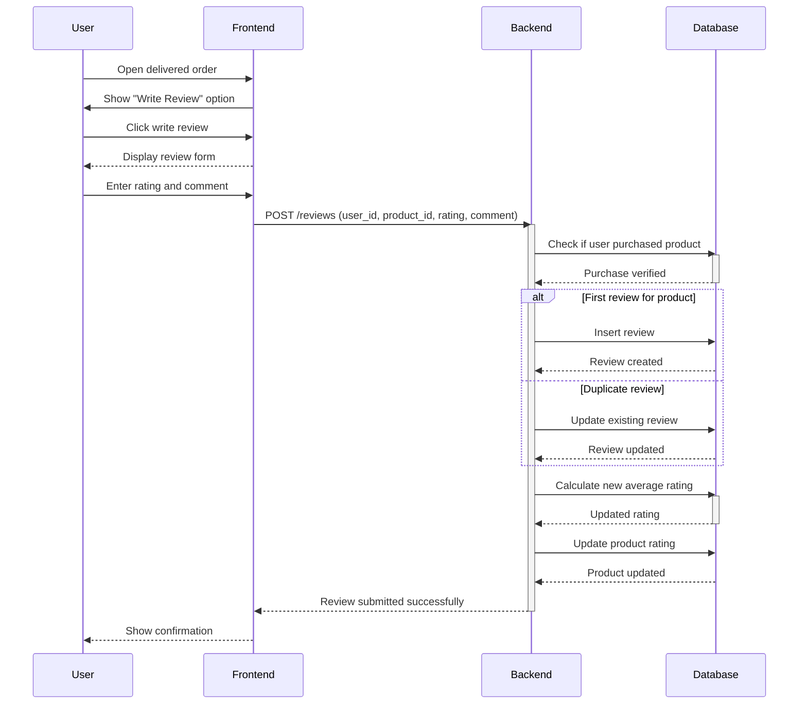
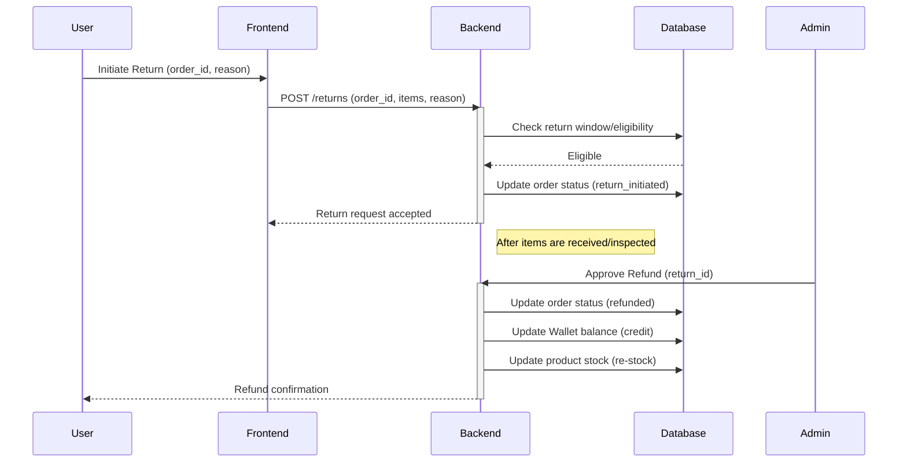
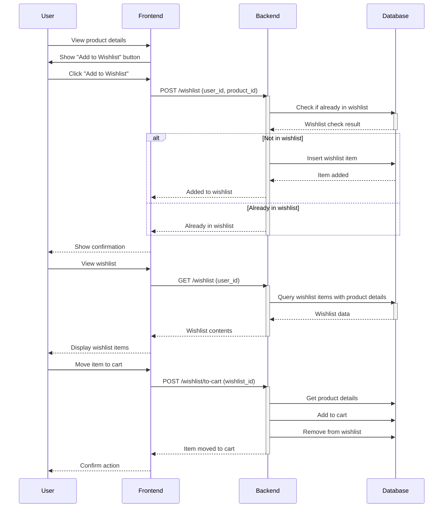

# E-Commerce Platform - Sequence Diagrams

## 1. User Registration and Login Flow



## 2. Product Browsing and Search Flow



## 3. Shopping Cart Management Flow



## 4. Checkout and Payment Flow



## 5. Order Tracking Flow



## 6. Product Review and Rating Flow



## 7. Product Return and Refund Flow



## 8. Wishlist Management Flow



## 8. Admin Product Management Flow

```mermaid
sequenceDiagram
    participant Admin
    participant Frontend
    participant Backend
    participant Database

    Admin->>Frontend: Login to admin panel
    Frontend->>Backend: POST /admin/login
    activate Backend
    Backend->>Database: Verify admin credentials
    Database-->>Backend: Admin verified
    Backend-->>Frontend: Admin session
    deactivate Backend
    Frontend-->>Admin: Show admin dashboard

    Admin->>Frontend: Add new product
    Frontend-->>Admin: Display product form
    Admin->>Frontend: Fill product details
    Frontend->>Backend: POST /admin/products (name, price, stock, category_id, description, image)
    activate Backend
    Backend->>Database: Validate category exists
    Backend->>Database: Insert product
    Database-->>Backend: Product created (product_id)
    Backend-->>Frontend: Product added successfully
    deactivate Backend
    Frontend-->>Admin: Show confirmation with product_id

    Admin->>Frontend: Update product stock
    Frontend->>Backend: PUT /admin/products/{product_id}/stock (new_stock)
    activate Backend
    Backend->>Database: Update stock quantity
    Database-->>Backend: Stock updated
    Backend-->>Frontend: Stock updated
    deactivate Backend
    Frontend-->>Admin: Confirm update

## 10. Admin Reports and Analytics Flow

```mermaid
sequenceDiagram
    participant Admin
    participant Frontend
    participant Backend
    participant Database

    Admin->>Frontend: Click "Generate Sales Report"
    Frontend->>Backend: GET /admin/reports/sales?period=monthly
    activate Backend
    Backend->>Database: Aggregate sales data
    Database-->>Backend: Statistics
    Backend->>Backend: Format Report (PDF/CSV)
    Backend-->>Frontend: Report URL
    deactivate Backend
    Frontend-->>Admin: Show Download Link

    Admin->>Frontend: View Dashboard KPIs
    Frontend->>Backend: GET /admin/analytics/kpis
    activate Backend
    Backend->>Database: Fetch latest analytics
    Database-->>Backend: KPI metrics
    Backend-->>Frontend: KPI JSON
    deactivate Backend
    Frontend-->>Admin: Render charts and graphs
```

## Key Interactions Summary
```

## Key Interactions Summary

1. **Registration & Login**: Users create accounts and authenticate via JWT tokens
2. **Product Discovery**: Users browse and search products with caching for performance
3. **Cart Management**: Items are added/removed with real-time stock validation
4. **Payment Processing**: Secure payment processing with multiple payment methods
5. **Order Tracking**: Real-time order status updates with notifications
6. **Reviews**: Users can rate products after delivery
7. **Wishlist**: Products saved for future purchase
8. **Admin Operations**: Administrators manage inventory and products
