# E-Commerce Platform - Use Case Diagram

```mermaid
graph TB
    subgraph Customer_UC["Customer Use Cases"]
        UC1["Browse Products"]
        UC2["Search Products"]
        UC3["View Product Details"]
        UC4["Filter Products"]
        UC5["Add to Cart"]
        UC6["View Cart"]
        UC7["Update Cart"]
        UC8["Apply Coupon"]
        UC9["Checkout"]
        UC10["Select Shipping Address"]
        UC11["Select Payment Method"]
        UC12["Process Payment"]
        UC13["Place Order"]
        UC14["Track Order"]
        UC15["Write Review"]
        UC16["Rate Product"]
        UC17["Add to Wishlist"]
        UC18["View Wishlist"]
        UC19["Register Account"]
        UC20["Login"]
        UC21["Update Profile"]
        UC22["Manage Addresses"]
        UC23["View Order History"]
        UC24["Cancel Order"]
        UC25["Return Product"]
    end
    
    subgraph Admin_UC["Admin Use Cases"]
        UC26["Manage Products"]
        UC27["Manage Inventory"]
        UC28["View Orders"]
        UC29["Process Refunds"]
        UC30["Generate Reports"]
        UC31["Manage Coupons"]
    end
    
    subgraph System_UC["System Use Cases"]
        UC12S["Process Payment"]
        UC13S["Place Order"]
    end
    
    Customer["👤 Customer"]
    Admin["👤 Admin"]
    System["⚙️ System"]
    
    Customer -->|uses| UC1
    Customer -->|uses| UC2
    Customer -->|uses| UC3
    Customer -->|uses| UC4
    Customer -->|uses| UC5
    Customer -->|uses| UC6
    Customer -->|uses| UC7
    Customer -->|uses| UC8
    Customer -->|uses| UC9
    Customer -->|uses| UC10
    Customer -->|uses| UC11
    Customer -->|uses| UC14
    Customer -->|uses| UC15
    Customer -->|uses| UC16
    Customer -->|uses| UC17
    Customer -->|uses| UC18
    Customer -->|uses| UC19
    Customer -->|uses| UC20
    Customer -->|uses| UC21
    Customer -->|uses| UC22
    Customer -->|uses| UC23
    Customer -->|uses| UC24
    Customer -->|uses| UC25
    
    Admin -->|uses| UC26
    Admin -->|uses| UC27
    Admin -->|uses| UC28
    Admin -->|uses| UC29
    Admin -->|uses| UC30
    Admin -->|uses| UC31
    
    System -->|executes| UC12S
    System -->|executes| UC13S
    
    UC1 -.->|includes| UC3
    UC2 -.->|includes| UC3
    UC4 -.->|extends| UC1
    UC5 -.->|includes| UC3
    UC6 -.->|includes| UC5
    UC7 -.->|includes| UC6
    UC8 -.->|includes| UC9
    UC10 -.->|includes| UC9
    UC11 -.->|includes| UC9
    UC9 -.->|includes| UC12
    UC13 -.->|includes| UC12
    UC14 -.->|includes| UC13
    UC15 -.->|extends| UC14
    UC16 -.->|includes| UC15
    UC17 -.->|extends| UC3
    UC21 -.->|extends| UC19
    UC23 -.->|extends| UC13
    UC25 -.->|extends| UC14
    UC27 -.->|includes| UC26
    UC29 -.->|includes| UC28
    UC31 -.->|includes| UC26
```

## Use Case Descriptions

### Customer Use Cases

#### 1. **Browse Products (UC1)**
- Customer views products organized by category
- Can see product thumbnails, names, and basic information
- Related: Filter Products, View Product Details

#### 2. **Search Products (UC2)**
- Customer enters search query
- System returns matching products
- Can filter results by various criteria

#### 3. **View Product Details (UC3)**
- Customer clicks on a product to see full information
- Displays images, description, specifications, price, and reviews
- Shows in-stock/out-of-stock status
- Precondition: Browse or Search for products

#### 4. **Filter Products (UC4)**
- Customer applies filters like price range, ratings, brand, etc.
- Narrows down product list
- Extends: Browse Products

#### 5. **Add to Cart (UC5)**
- Customer selects quantity and adds product to cart
- System validates stock availability
- Precondition: View Product Details
- Includes: View Product Details

#### 6. **View Cart (UC6)**
- Customer views all items in their shopping cart
- Shows quantity, price per item, and total price
- Precondition: Add to Cart

#### 7. **Update Cart (UC7)**
- Customer can update item quantities or remove items
- System recalculates total price
- Precondition: View Cart

#### 8. **Apply Coupon (UC8)**
- Customer enters a discount code
- System validates the coupon
- Applies discount to order total
- Precondition: View Cart
- Included in: Checkout

#### 9. **Checkout (UC9)**
- Customer initiates purchase process
- Includes: Select Shipping Address, Select Payment Method, Process Payment
- Includes: Apply Coupon

#### 10. **Select Shipping Address (UC10)**
- Customer chooses delivery address
- Can select from saved addresses or add new one
- Precondition: Checkout

#### 11. **Select Payment Method (UC11)**
- Customer chooses payment method (Card, UPI, Wallet, COD)
- Enters or confirms payment details
- Precondition: Checkout

#### 12. **Process Payment (UC12)** [System]
- System processes payment through payment gateway
- Validates payment details
- Returns transaction status
- System Use Case (triggered during Checkout)

#### 13. **Place Order (UC13)**
- System creates order record after successful payment
- Generates order confirmation and receipt
- Sends confirmation to customer
- System Use Case (includes Process Payment)

#### 14. **Track Order (UC14)**
- Customer views real-time order status
- Shows shipment tracking information
- Can view estimated delivery date
- Precondition: Place Order

#### 15. **Write Review (UC15)**
- Customer writes text review for a product
- Includes: Rate Product
- Extends: Track Order (after delivery)

#### 16. **Rate Product (UC16)**
- Customer assigns star rating (1-5) to product
- Precondition: Product delivered
- Included in: Write Review

#### 17. **Add to Wishlist (UC17)**
- Customer saves product for future reference
- Extends: View Product Details

#### 18. **View Wishlist (UC18)**
- Customer views all wishlist items
- Can move items to cart or remove them

#### 19. **Register Account (UC19)**
- Customer creates new account with email and password
- System sends verification email
- Precondition: New user

#### 20. **Login (UC20)**
- Customer authenticates with email and password
- System validates credentials and generates session token
- Precondition: Registered user

#### 21. **Update Profile (UC21)**
- Customer updates personal information (name, phone, etc.)
- Extends: Login
- Precondition: Logged in

#### 22. **Manage Addresses (UC22)**
- Customer adds, updates, or deletes delivery addresses
- Can set default address
- Precondition: Logged in

#### 23. **View Order History (UC23)**
- Customer views all past and current orders
- Shows order dates, amounts, and statuses
- Extends: Place Order
- Precondition: Logged in

#### 24. **Cancel Order (UC24)**
- Customer cancels order if not yet shipped
- System initiates refund process
- Precondition: Logged in, Active order

#### 25. **Return Product (UC25)**
- Customer initiates product return after delivery
- Provides reason for return
- Extends: Track Order

### Admin Use Cases

#### 26. **Manage Products (UC26)**
- Admin adds, edits, or deletes products
- Updates product information, images, and descriptions
- Includes: Manage Inventory

#### 27. **Manage Inventory (UC27)**
- Admin updates product stock levels
- Sets low stock alerts
- Included in: Manage Products

#### 28. **View Orders (UC28)**
- Admin views all customer orders
- Can filter by date, status, customer, etc.
- Includes: Process Refunds

#### 29. **Process Refunds (UC29)**
- Admin approves and processes customer refunds
- Tracks refund status
- Included in: View Orders

#### 30. **Generate Reports (UC30)**
- Admin generates sales reports, revenue analytics, etc.
- Exports reports in various formats
- Precondition: Admin logged in

#### 31. **Manage Coupons (UC31)**
- Admin creates, updates, or deactivates coupon codes
- Sets discount amounts, expiry dates, and usage limits
- Included in: Manage Products

## Actor Definitions

### **Customer**
- Primary user of the ecommerce platform
- Browses products, makes purchases, tracks orders
- Writes reviews and manages wishlist

### **Admin**
- Manages product catalog and inventory
- Monitors orders and processes refunds
- Creates promotional offers and generates reports

### **System**
- Executes automated processes
- Processes payments through payment gateway
- Creates and confirms orders

## Relationship Types

- **Uses (-->)**: Actor initiates the use case
- **Includes (.>)**: One use case always includes another
- **Extends (.>)**: One use case optionally extends another
- **Associations**: Show which actors interact with which use cases

## Key Business Flows

1. **Customer Shopping Flow**: Browse → Search → Filter → View Details → Add to Cart → Checkout → Payment → Order
2. **Customer Post-Purchase**: Track Order → Delivery → Write Review → Return (optional)
3. **Admin Management**: Manage Products → Manage Inventory → Process Orders → Generate Reports
